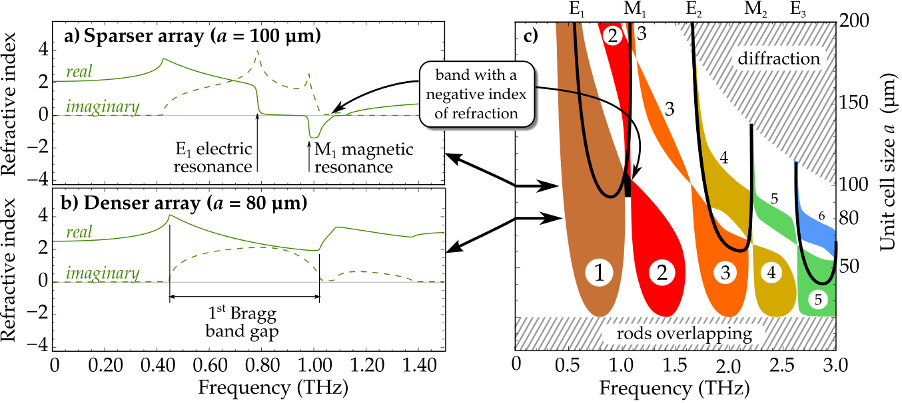

# My dissertation thesis on metamaterial simulations

The thesis was successfully defended in 2016, although if I were back at the start of my PhD project, I would have done many things in a completely different way: I would care much more about focusing on a topic with a real scientific impact, and most likely the project would not involve the troublesome topic of metamaterials at all.
However, now it is finished and while not overly proud about its form, I believe it may still be useful for someone. 

In a nutshell, the text 
 1) covers the optics of periodic structures - metamaterials and photonic crystals, 
 1) demonstrates the importance of taking the spatial dispersion into account, although it is often neglected in the literature,
 1) reviews some historical papers showing that the notion of metamaterials are not as novel as is sometimes advertised,
 1) describes [the numerical computation technique used](https://github.com/FilipDominec/python-meep-utils) and  
 1) in the Results section, it demonstrates the characteristic behaviour of periodic structures that are most often used. 

You may either clone whole LaTeX project, or ***[directly download the thesis PDF here](t.pdf)*** (25 MB). The ***[defence presentation](presentation/dominec-defence.beamer.pdf)*** is also available (3.5 MB) along with its LaTeX/beamer sources.

